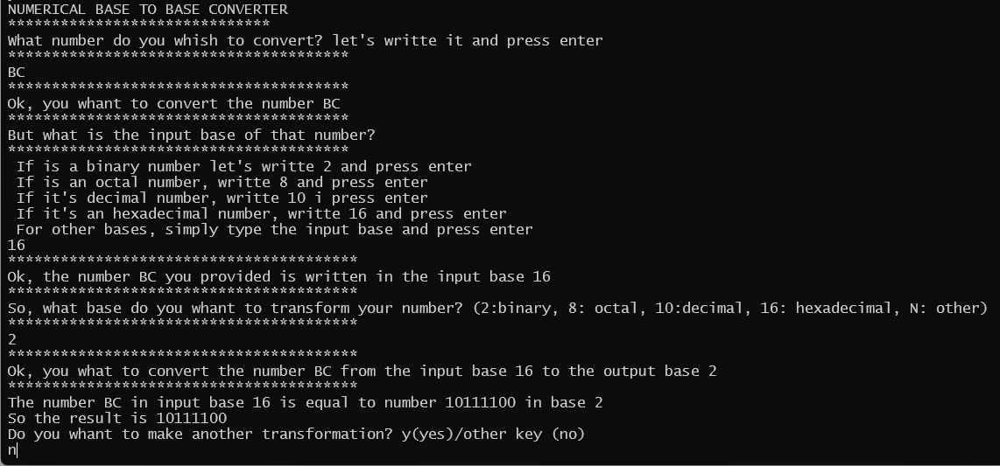

# Base2Base
An interactive bash script to convert numbers between basis (2: binary, 8: octal, 10: decimal, 16: hexadecimal, N: other basis)

Requirements: 
+ Tested on Ubuntu 20.04 LTS over Windows Subsystem for Linux (WSL) machine
+ bc program

Available in English, Spanish and Catalan

Install the program by setting an alias using the source in current directory (change _eng to _spa for spanish version or _cat for catalan):

```bash
cd Base2Base
echo "alias b2b=$PWD/b2b_eng.sh" >> ~/.bashrc
source ~/.bashrc
```

Example of usage:

<p align="left">

</p>


  
  
